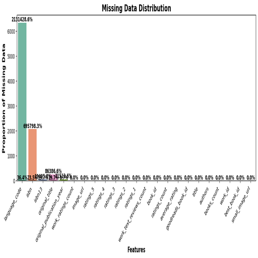

# The Legend of the Dataset
In a realm of literary knowledge, the "Goodreads" dataset emerged, comprising 10,000 samples and 23 features. This dataset captures the essence of books, revealing insights into authors, ratings, and the reading habits of enthusiasts. The journey through this data unveils both the treasures and pitfalls in the domain of literature.

# The Great Data Expedition
To navigate this vast repository, a meticulous analysis was conducted on each feature's statistics. The journey involved uncovering the types of data within the framework, identifying the missing pieces that obstruct the clarity of the narrative, and exploring the unique values that characterize this literary universe.

# The Statistical Secrets
The analysis revealed:
- **Books Count**: A mean of 75.71 with extreme variability, indicating a skew toward a few prolific authors.
- **Average Ratings**: A mean of 4.00 shows overall favorable reception but highlights a negative skew, suggesting more high ratings.
- **Missing Data**: The feature `language_code` stands out, with over 6% of its records missing, indicating a need for attention.

# The Visual Prophecies

The plot signifies the distribution of missing data across features. Notably, `language_code` holds the highest proportion of missing values at 6.1%, while other features maintain minimal absence. This visualization underscores the importance of addressing gaps in data collection for effective analysis.

# The Future Insights
To enhance the dataset's reliability and insights:
- **Data Completeness**: Focus on mitigating missing values, particularly in `language_code` to enrich analyses related to linguistic demographics.
- **Deeper Analysis**: Exploit correlations between author popularity and book ratings to derive marketing strategies for publishers and self-aware authors.
- **User Engagement**: Leverage unique features to foster better reader connections through personalized recommendations based on reading patterns revealed in this treasure trove of literary data.