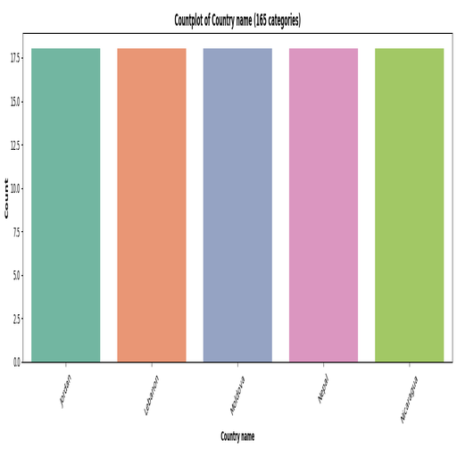

# The Legend of the Dataset
In the realm of statistics, a sacred dataset has been discovered, containing insights into global happiness. This dataset not only captures the subjective well-being of individuals across various countries but also intertwines factors such as economic conditions, social support, and perceptions of corruption. With **2,363 samples** and **11 features**, it unravels narratives that provoke thought and action.

# The Great Data Expedition
To decode the mysteries held within this dataset, we embarked on a thorough examination. Using statistical analysis, we categorized the data, assessed its integrity, and visualized its components:
- **Data Sources:** The primary CSV file ‘happiness.csv’ served as our canvas.
- **Feature Analysis:** Each feature was analyzed for its type, uniqueness, and distribution.
- **Missing Data:** We identified and noted instances of missing data across various features.
- **Visual Representation:** Count plots and distributions were created to represent the categorical nature of the data effectively. 

# The Statistical Secrets
## Dataset Overview
- **Total Samples:** 2,363
- **Unique Countries:** 165
- **Key Features:**
  - Life Ladder: Measures subjective well-being.
  - Log GDP per capita: Economic indicator.
  - Social Support: Measure of community support.
  - Several other factors contributing to happiness.

## Missing Mysteries
- Several features exhibited missing data, notably in **Log GDP per capita** and **Generosity**, which necessitates careful consideration in our conclusions.

## Unique Universe
- The **Life Ladder** revealed a wide range of happiness scores, from a minimum of 1.281 to a maximum of 8.019, highlighting disparities in happiness across different nations.

# The Visual Prophecies

- The above count plot illustrates the distribution of responses from different countries. Notably, **Lebanon**, **Jordan**, **Nicaragua**, **Nepal**, and **Moldova** are represented **18 times each**, indicating a balanced representation in the dataset, which adds depth to our analysis of regional happiness.

# The Future Insights
Based on our findings, we recommend:
1. **Targeted Happiness Programs:** Countries with lower Life Ladder scores should evaluate local factors affecting happiness.
2. **Further Research:** Investigate the relationship between economic indicators and happiness measures.
3. **Data Enrichment:** Efforts to fill in missing values should be prioritized, focusing on crucial metrics like **Log GDP per capita** and **Generosity**.
4. **Policy Development:** Governments should utilize these insights to shape policies that enhance social support and address perceptions of corruption, ultimately improving citizen well-being.

In the intricate web of data, every number has a name, and every insight beckons for action.