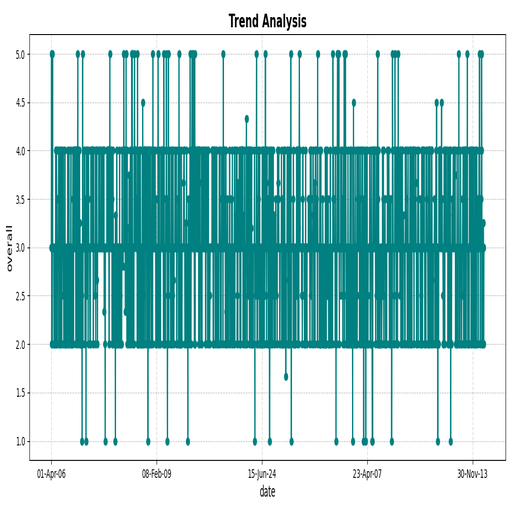

# The Legend of the Dataset

In exploring the vast landscape of media content, we uncover a dataset comprising 2,652 samples and 8 features. This treasure trove offers insight into varying media types across different languages, their publication dates, and qualitative assessments such as overall quality, quality ratings, and repeatability. This repository serves as a narrative on evolving trends in linguistic media representation.

---

# The Great Data Expedition

The methodology involved a thorough examination of the dataset to identify data types, their distributions, and notable missing values. Each feature was scrutinized to uncover unique entries and understand the context and significance of each media type. Key analyses were performed to decipher the relationships between features and assess temporal trends in the dataset.

---

# The Statistical Secrets

## Key Findings:
- **Language Distribution:** Predominantly, content is in English (1306 entries), followed by Tamil and Telugu.
- **Content Types:** Movies (2211) are the most represented category, overshadowing series and short films. 
- **Quality Ratings:** The overall quality ratings range from 1 to 5, with a mean of approximately 3.05. The most frequent rating is 3.
- **Repeatability:** The data shows a lean towards a rating of 1 for repeatability, hinting at content consumption patterns.

---

# The Visual Prophecies

The visualization presents an intricate portrayal of the quality ratings over time. The x-axis represents dates, while the y-axis depicts the overall ratings from 1 to 5. Notable consistency in ratings emerges, with spikes indicating specific periods of high-rated content. The broad spread of points suggests varying levels of quality across different dates, emphasizing the ever-changing media landscape.

---

# The Future Insights

## Recommendations:
1. **Content Strategy:** Focus on producing more content in widely spoken languages while exploring niches in underrepresented languages.
2. **Quality Enhancements:** Leverage data insights from high-rated periods to refine content quality guidelines and improve lower-rated areas.
3. **Temporal Analysis:** Continuously monitor trends to anticipate shifts in media consumption patterns, facilitating timely content releases.

This exploration unveils a grand tale of trends, quality, and media representation. The data sings of growth, diversity, and the ever-evolving narrative that shapes our media landscape.